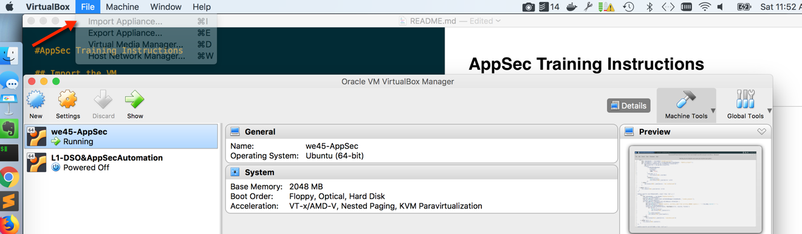
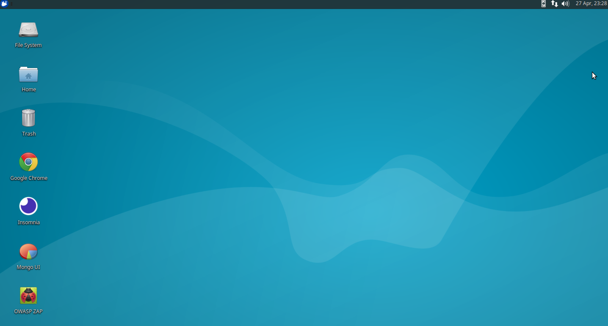

# DEFCON 26 Workshop - Building Autonomous AppSec Pipelines with the Robot Framework

## Laptop Requirements
- Intel i5 or above, 8GB+ RAM required, at least 50GB HDD 
- If you are using a Win Laptop, you will need to enable virtualization. Please see [here](https://www.howtogeek.com/213795/how-to-enable-intel-vt-x-in-your-computers-bios-or-uefi-firmware/)
- Please ensure that you install the latest version of Oracle VM VirtualBox on your host computer
- Please ensure that you are able to connect to the WiFi. We will be downloading small third party packages for this class
- Please ensure that the VM is imported and installed on your Virtualbox

## Import the VM
* Download the VM from [here:](https://drive.google.com/drive/folders/1K_vS-AbXomhgeVdfcB1eEhWPwOzuEGed?usp=sharing)
* Open Virtualbox and open the `File` Menu
* Click on the `Import Appliance` option

* Once done, select the `.ova` file that you have downloaded and import the appliance
* Make sure you give the appliance at least `2048 MB` of RAM while importing

* Wait for the import process to complete. This may take several minutes.
* Select the VM and click on the start arrow to start the Virtual Machine, please wait while it boots. Please click through any notifications you might get
* If all goes well, you should directly booted into a Desktop environment that looks like this:

That's it! You're all set!

* Please follow the instructions in the `instructions` directory in class - TBD

